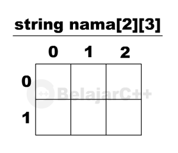
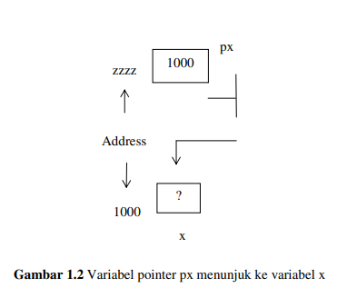
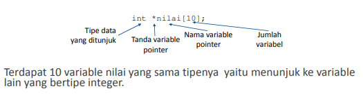
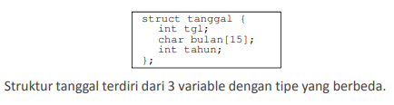
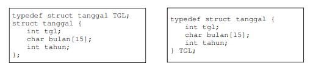

# Array

Array atau larik adalah variabel yang terdiri dari sekumpulan data terstruktur yang mempunyai tipe data yang sama. Setiap data disimpan di alamat memori yang berbeda-beda yang disebut dengan elemen array. Setiap elemen mempunyai nilai index sesuai urutannya. melalui index inilah kita dapat mengakses data-data tersebut. Umumnya index dari elemen array dimulai dari 0.

Array juga bersifat statis, dimana alokasi memori dilakukan saat deklarasi source code.

Contoh deklarasi array:


- Dalam contoh diatas terdapat 10 variabel dengan tipe yang sama yaitu integer.

Untuk mengakses array harus ditentukan index yang diakses.

Contoh:

```c
#include <stdio.h>

void main() {
  int bilangan[10], i;
  for(i=0;i<10;i++){
    bilangan[i] = 2*i;
    printf("%d %d\n", i, bilangan[i]);
  }
}
/*
Output:
7 14
8 16
9 18
*/
```

- Contoh diatas kita mengakses elemen array berdasarkan looping(perulangan) kemudian menginisiasikan valuenya dan kembali mengakses arraynya untuk dicetak kedalam output.

Terdapat juga jenis array yang lainnya yaitu:

- Array 2 Dimensi  
  Deklarasi array 2 dimensi:
  `string nama[2][3]`  
  Array dua dimensi memungkinkan kita untuk menggunakan array di dalam array, setiap array memiliki array di dalamnya. <br><br>

  Array dua dimensi bisa digambarkan seperti sebuah tabel yang mempunyai baaris dan kolom array pertama adalah sebuah baris dan array kedua adalah sebuah kolom berikut ilustrasinya:  
  

- Array Multidimensi  
  Array multidimensi merupakan array yang mempunyai ukuran lebih dari dua. Jika kita sudah mengerti mengenai konsep dari array, kita akan dengan mudah untuk memodifikasi array, menambahkan beberapa subscript untuk menjadikanya array multidimensi. Secara garis besar, pembuatan, penggunaan, pengaksesan array multi dimensi memiliki konsep yang sama seperti apa yang telah penulis jelaskan di atas pada array dua dimensi.

# Pointer

Pointer adalah variabel yang menunjuk ke lokasi alamat memori tertentu. Variabel pointer sering dikatakan sebagai variabel yang menunjuk ke obyek lain. Pada kenyataan yang sebenarnya, variabel pointer berisi alamat dari suatu obyek lain (yaitu obyek yang dikatakan ditunjuk oleh pointer). Sebagai contoh `px` adalah
variabel pointer dan `x` adalah variabel yang ditunjuk oleh `px`. Kalau `x` berada pada alamat memori (alamat awal) `0x1000`, maka `px` akan berisi `1000`.

Lebih jelasnya mari kita lihat ilustrasi berikut:


Variabel pointer juga bersifat dinamis (kebalikan dari array), dimana alokasi memori dilakukan pada saat program dijalankan.

Contoh deklarasi pointer:


- Variabel nilai menunjuk ke variable lain yang bertipe integer

Berikut ini adalah contoh cara mengakses pointer:

```c
#include <stdio.h>

void main() {
  int a, *b;
  a = 5;
  b = &a;
  printf("%d %d\n", a, *b);
}
/*
Output:
5 5
*/
```

- variabel `b` menampung alamat memori variabel `a`

# Array of Pointer

Array of pointer adalah sekumpulan array dengan tipe data pointer.

Contoh deklarasi array of pointer:


```c
#include <stdio.h>

void main() {
  int *bil[3], a, b, c, i;
  a = 5;
  b = 10;
  c = 15;
  bil[0] = &a;
  bil[1] = &b;
  bil[2] = &c;
  for(i=0;i<3;i++)
    printf("%d\n", *bil[i]);
}
/*
Output:
5
10
15
*/
```

- kita liat pada source code diatas setiap elemen arraynya menampung alamat memori dari variabel yang didefinisikan sebelumnya.
- kemudian kita tampilkan value dari array `bil` dengan method `print` maka valuenya akan berisi value dari alamat memori variabel yang direferensikan.

Hubungan antara pointer dan array pada C sangatlah erat. Sebab
sesungguhnya array secara internal akan diterjemahkan dalam bentuk pointer.

Misalnya dideklarasikan di dalam suatu fungsi  
`static int tgl_lahir[3] = { 01, 09, 64 };` dan `int *ptgl;`  
Kemudian diberikan instruksi  
`ptgl = &tgl_lahir[0];`  
maka ptgl akan berisi alamat dari elemen array `tgl_lahir` yang berindeks nol.
Instruksi di atas bisa juga ditulis menjadi  
`ptgl = tgl_lahir;`  
sebab nama array tanpa tanda kurung menyatakan alamat awal dari array. Sesudah
penugasan seperti di atas,  
`*ptgl` dengan sendirinya menyatakan elemen pertama (berindeks sama dengan nol) dari array `tgl_lahir`.

# Structures / Struktur

Struktur adalah sekumpulan variabel yang mempunyai tipe yang berbeda. Struktur dapat
digunakan untuk mengelompokkan beberapa informasi yang berkaitan menjadi
sebuah satu kesatuan.
Struktur merupakan user defined variabel, yang artinya variabel yang didefinisikan sendiri oleh
user.

Contoh deklrasi structure:


Deklarasi Struktur dengan typedef

- typedef berfungsi sebagai nama lain / alias dari tipe data.
- typedef digunakan untuk meringkas tipe data struktur sehingga mudah
  diakses.



Element dalam structures dapat diakses dengan bentuk berikut `variabel_struktur.nama_field `.

```c
#include <stdio.h>

typedef struct tanggal {
    int tgl;
    char bulan[15];
    int tahun;
} TGL;

void main()
{
    TGL a;
    a.tgl = 17;
    strcpy(a.bulan,"Agustus");
    a.tahun = 1945;
    printf("%d %s %d\n", a.tgl, a.bulan, a.tahun);
}

/*
Output:
17 Agustus 1945
*/
```

# Array Of Structures

Elemen-elemen dari suatu array juga dapat berbentuk sebuah struktur. Misalnya
array yang dipakai untuk menyimpan sejumlah data mahasiswa. Array
struktur berdimensi satu ini membentuk suatu tabel, dengan barisnya menunjukkan
elemen dari array-nya dan kolomnya menunjukkan elemen dari struktur. Dalam hal
ini maka deklarasi yang dibutuhkan adalah sebagai berikut :

```c
#include <stdio.h>
#include <stdlib.h>
#include <string.h>


typedef struct mahasiswa {
    char nama[10];
    int nim;
} MHS;

void main()
{
    MHS mahasiswa_baru[2];
    int i;
    strcpy(mahasiswa_baru[0].nama, "Luffy");
    mahasiswa_baru[0].nim = 281820;
    strcpy(mahasiswa_baru[1].nama, "Sanji");
    mahasiswa_baru[1].nim = 210290;
    printf("%s %s\n", "Nama","Nim");
    for(i=0;i<2;i++)
      printf(" %s %d \n",mahasiswa_baru[i].nama, mahasiswa_baru[i].nim);
}

/*
Output:
Nam   Nim
Luffy 281820
Sanji 210290
*/
```

Jadi kesimpulannya:

- Array merupakan sekumpulan variabel yang mempunyai tipe yang sama
- Pointer merupakan variabel yang menunjuk ke lokasi alamat tertentu
- Sekumpulan variabel yang mempunyai tipe yang berbeda
