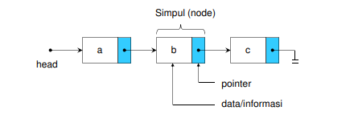
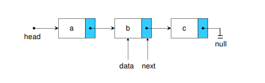
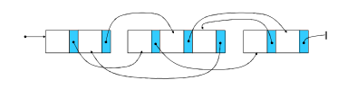

# Single Linked List

Single Linked List adalah sekumpulan dari node yang saling terhubung dengan node lain melalui sebuah pointer. Single Linked List hanya memiliki satu arah. Node disini merupakan sekelompok data yang diorganisasi secara dinamis dengan urutan tertentu.



- Single Linked List terdiri dari elemen-elemen individu yang dihubungkan dengan pointer tunggal.
- Masing-masing elemen terdiri dari dua bagian, yaitu bagian
  data/informasi yang disimpan dan bagian pointer yang disebut
  dengan pointer next.
- Pointer next pada elemen terakhir merupakan NULL, yang
  menunjukkan akhir dari suatu list.
- Elemen awal diakses oleh pointer head.



Alokasi Memori pada Single Linked List

- Elemen-elemen linked list dialokasikan secara dinamis menggunakan malloc (malloc (Memory Allocation) adalah sebuah fungsi fasilitas untuk memesan tempat secara berurutan untuk tipe data pointer dengan jumlah data dinamis.)
- Lokasinya terpencar-pencar di memori
- Pointer menjamin semua elemen dapat diakses.



Single Linked List sendiri pun, terdapat beberapa metode yang dapat dilakukan yaitu :

- Creation
- Insert :
  - Depan
  - Belakang
  - Posisi
- Delete :
  - Depan
  - Belakang
  - Posisi
- Traversal
- Sorting
- Searching
- Termination

Berikut adalah contoh implementasi Single Linked List:

##### Inisiasi linked list

```c
typedef struct human human;
struct human{
	int age;
	char name[30];
	human *next;
} *head, *tail, *current;
// head adalah pointer yang menyimpan alamat data pertama
// tail adalah pointer yang menyimpan alamat data terakhir
// current adalah pointer yang digunakan sebagai temporary variabel
```

##### Menyisipkan data ke barisan paling awal

```c
void pushHead(int age, char name[]){
	// alokasi memory untuk data baru
	current = (human*)malloc(sizeof(struct human));
	// assign data ke dalam struct
	current->age = age;
	strcpy(current->name, name);

	// apabila linked list kosong/tidak ada data
	if(head == NULL){
		head = tail = current;
	}
	// kondisi tidak kosong
	else{
		current->next = head;
		head = current;
	}
}
```

##### Menyisipkan data ke barisan paling akhir

```c
void pushTail(int age, char name[]){
	// alokasi memory untuk data baru
	current = (human*)malloc(sizeof(struct human));
	// assign data ke dalam struct
	current->age = age;
	strcpy(current->name, name);

	// apabila linked list kosong/tidak ada data
	if(head == NULL){
		head = tail = current;
	}
	// kondisi tidak kosong
	else{
		tail->next = current;
		tail = current;
	}
	tail->next = NULL;
}
```

##### Menyisipkan data ke barisan di tengah (sorting)

```c
void pushMid(int age, char name[]){
	// alokasi memory untuk data baru
	current = (human*)malloc(sizeof(struct human));
	// assign data ke dalam struct
	current->age = age;
	strcpy(current->name, name);

	// apabila linked list kosong/tidak ada data
	if(head == NULL){
		head = tail = current;
	}
	// jika umur data yang barusan dimasukkan lebih kecil dari umur data pertama (head)
	else if(current->age < head->age){
		pushHead(age, name);
	}
	// jika umur data yang barusan dimasukkan lebih besar dari umur data terakhir (tail)
	else if(current->age > tail->age){
		pushTail(age, name);
	}
	// push ditengah-tengah
	else{
		human *temp = head;
		// mencari posisi data yang sesuai untuk diselipkan
		while(temp->next->age < current->age){
			temp = temp->next;
		}
		current->next = temp->next;
		// mengarahkan penunjuk ke alamat data baru
		temp->next = current;
	}
}
```

##### Menghapus data paling awal

```c
void popHead(){
	//inisialisasi current sebagai head
	current=head;
	//jika head kosong (tidak ada data)
	if(head==NULL){
		//cetak tidak ada data
		printf("No data");
	//jika head dan tail itu sama (hanya 1 data)
	}else if(head==tail){
		//head dan tail dikosongkan
		head=tail=NULL;
		//hapus data current (head)
		free(current);
	}else{
		//set head menjadi data selanjutnya dari head
		head=head->next;
		//hapus data current (head)
		free(current);
	}
}
```

##### Menghapus data paling akhir

```c
void popTail(){
	//jika head kosong (tidak ada data)
	if(head==NULL){
		//cetak tidak ada data
		printf("No data");
	//jika head dan tail itu sama (hanya 1 data)
	}else if(head==tail){
		//head dan tail dikosongkan
		head=tail=NULL;
		//hapus data current (head)
		free(current);
	}else{
		//buat variabel penampung baru dan assign nilai mulai dari head
		human *temp=head;
		//looping untuk mencari posisi 1 data sebelum tail
		while(temp->next!=tail){
			//temp diubah menjadi 1 data selanjutnya
			temp=temp->next;
		}
		//set data current menjadi tail
		current=tail;
		//set tail menjadi 1 data sebelum tail (hasil looping)
		tail=temp;
		//hapus data current (tail)
		free(current);
		//data setelah next dikosongkan/pointer next punya tail diberi NULL
		tail->next=NULL;
	}
}
```

##### Menghapus data ditengah (sesuai parameter value)

```c
// kita akan menghapus data sesuai dengan umurnya.
void popMid(int age){
	//jika head kosong (tidak ada data)
	if(head==NULL){
		printf("No data");
	//jika umur si head(data pertama) sama dengan data umur yang mau dihapus
	}else if(head->age==age){
		//pop head
		popHead();
	//jika umur si tail(data terakhir) sama dengan data umur yang mau dihapus
	}else if(tail->age==age){
		//pop tail
		popTail();
	}else{
		//buat variabel penampung baru dan assign nilai mulai dari head
		human *temp=head;
		//looping untuk mencari posisi 1 data sebelum tail
		while(temp->next->age!=age && temp!=tail){
			//temp diubah menjadi 1 data selanjutnya
			temp=temp->next;
		}
		//set data current menjadi data selanjutnya dari temp
		current=temp->next;
		//data selanjutnya dari temp diubah menjadi 2 data setelah temp
		temp->next=temp->next->next;
		//hapus data current
		free(current);
	}
}
```

##### Menghapus semua data linked list

```c
void popAll(){
	while(head!=NULL){
		popHead();
	}
}
```

##### Print Data

```c
void print(){
	current = head;
	while(current != NULL){
		printf("%s - %d\n",current->name,current->age);
		current = current->next;
	}
}
```

##### Main function

```c
int main(){
	pushMid(18, "hery");
	pushMid(17, "mahirkoding");
	pushTail(22, "andi");
	pushHead(15, "tono");
	pushMid(11, "vandoro");
	pushMid(23, "budi");
	popHead();
	popTail();
	popMid(15);
        //popAll();
	print();
	getchar();
	return 0;
}
```

##### Full source

```c
#include <stdio.h>
#include <stdlib.h>
#include <string.h>

typedef struct human human;
struct human{
	int age;
	char name[30];
	human *next;
}*head, *tail, *current;

void pushTail(int age, char name[]){
	current = (human*)malloc(sizeof(struct human));
	current->age = age;
	strcpy(current->name, name);

	if(head == NULL){
		head = tail = current;
	}
	else{
		tail->next = current;
		tail = current;
	}
	tail->next = NULL;
}

void pushHead(int age, char name[]){
	current = (human*)malloc(sizeof(struct human));
	current->age = age;
	strcpy(current->name, name);

	if(head == NULL){
		head = tail = current;
	}
	else{
		current->next = head;
		head = current;
	}
}

void pushMid(int age, char name[]){
	current = (human*)malloc(sizeof(struct human));
	current->age = age;
	strcpy(current->name, name);

	if(head == NULL){
		head = tail = current;
	}
	else if(current->age < head->age){
		pushHead(age, name);
	}
	else if(current->age > tail->age){
		pushTail(age, name);
	}
	else{
		human *temp = head;
		while(temp->next->age < current->age){
			temp = temp->next;
		}
		current->next = temp->next;
		temp->next = current;
	}
}

void popHead(){
	current=head;
	if(head==NULL){
		printf("No data");
	}else if(head==tail){
		head=tail=NULL;
		free(current);
	}else{
		head=head->next;
		free(current);
	}
}

void popTail(){
	if(head==NULL){
		printf("No data");
	}else if(head==tail){
		head=tail=NULL;
		free(current);
	}else{
		human *temp=head;
		while(temp->next!=tail){
			temp=temp->next;
		}
		current=tail;
		tail=temp;
		free(current);
		tail->next=NULL;
	}
}

void popMid(int age){
	current=head;
	if(head==NULL){
		printf("No data");
	}else if(head->age==age){
		popHead();
	}else if(tail->age==age){
		popTail();
	}else{
		human *temp=head;
		while(temp->next->age!=age && temp!=tail){
			temp=temp->next;
		}
		current=temp->next;
		temp->next=temp->next->next;
		free(current);
	}
}

void popAll(){
	while(head!=NULL){
		popHead();
	}
}

void print(){
	current = head;
	while(current != NULL){
		printf("%s - %d\n",current->name,current->age);
		current = current->next;
	}
}

int main(){
	pushMid(18, "hery");
	pushMid(17, "mahirkoding");
	pushTail(22, "andi");
	pushHead(15, "tono");
	pushMid(11, "vandoro");
	pushMid(23, "budi");
	popHead();
	popTail();
	popMid(15);
	//popAll();
	print();
	getchar();
	return 0;
}
```

Catatan kesimpulan:

- Simpul pada single linked list terdiri dari bagian data dan pointer next
- Operasi pada single linked list terdiri dari operasi cetak, sisip dan hapus
- Operasi cetak dapat dilakukan dari head sampai akhir list
- Operasi sisip terdiri dari sisip awal list, sisip akhir list, sisip setelah simpul tertentu, sisip sebelum simpul tertentu
- Operasi hapus terdiri dari hapus awal list, hapus akhir list dan hapus simpul tertentu
- Implementasi Stack dengan single linked list, pada operasi Push dengan
- sisip awal list dan pada operasi Pop dengan hapus awal list
