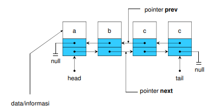

# Double Linked List

Pada artikel sebelumnya kita telah membahas Single Linked List, yakni linked list dengan sebuah pointer penghubung. Dalam artikel ini, dibahas pula varian linked list dengan 2 pointer penunjuk, yakni Double linked list yang memilki pointer penunjuk 2 arah, yakni ke arah node sebelum (previos/prev) dan node sesudah (next).

- Elemen-elemen dihubungkan dengan dua pointer dalam satu elemen.
- List bisa melintas baik ke depan maupun ke belakang.
- Masing-masing elemen terdiri dari tiga bagian
  - bagian data/informasi
  - pointer next yang menunjuk ke elemen berikutnya
  - pointer prev yang menunjuk ke elemen sebelumnya
- Untuk menunjukkan head dari double linked list, pointer prev dari elemen pertama menunjuk NULL.
- Untuk menunjukkan tail dari double linked list tersebut, pointer next dari elemen terakhir menunjuk NULL.



Beberapa metode yang ada didalam Double Linked List pada dasarnya sama dengan yang ada didalam Single Linked List yakni:

- Creation
- Insert :
  - Depan
  - Belakang
  - Posisi
- Delete :
  - Depan
  - Belakang
  - Posisi
- Traversal
- Sorting
- Searching
- Termination

Berikut adalah contoh implementasi Double Linked List:

##### Inisiasi Linked List

```c
#include <stdio.h>
#include <stdlib.h>
#include <string.h>

struct human{
	//menampung integer umur
	int age;
	//menampung nama manusia
	char name[30];
	//menampung alamat dari data selanjutnya dan sebelumnya
	human *next, *prev;
}*head, *tail, *current;
//head adalah pointer yang menyimpan alamat data pertama
//tail adalah pointer yang menyimpan alamat data terakhir
//current adalah pointer yang digunakan sebagai temporary variabel
```

##### Menyisipkan data ke barisan paling awal

```c
void pushHead(int age, char name[]){
	// membuat blok data baru
	current = (struct human *)malloc(sizeof human);
	// mengisi data
	strcpy(current->name, name);
	current->age=age;
	// membuat penunjuk data lain menjadi NULL terlebih dahulu
	current->next = current->prev=NULL;

	// jika tidak ada data
	if(head==NULL){
		//maka akan jadi data pertama, head dan tail akan sama dengan data baru
		head=tail=current;
	// jika ada data
	}else{
		//pergantian head menjadi data terbaru
		head->prev=current;
		current->next=head;
		head=current;
	}
}
```

##### Menyisipkan data ke barisan paling akhir

```c
void pushTail(int age, char name[]){
	// membuat blok data baru
	current = (struct human *)malloc(sizeof human);
	// mengisi data
	strcpy(current->name, name);
	current->age = age;
	// membuat penunjuk data lain menjadi NULL terlebih dahulu
	current->prev = current->next = NULL;

	// jika tidak ada data
	if(head==NULL){
		// maka akan jadi data pertama, head dan tail akan sama dengan data baru
		head=tail=current;
	// jika ada data
	}else{
		// pergantian tail menjadi data terbaru
		current->prev = tail;
		tail->next = current;
		tail = current;
	}
}
```

##### Menyisipkan data ke barisan berdasarkan umur (searching)

```c
void PushMid(int age, char name[]){
	// jika tidak ada data
	if(head==NULL){
		// pushHead
		pushHead(age,name);
	// jika umur yang akan dimasukkan lebih kecil dari umur data ke head
	}else if(age < head->age){
		// pushHead
		pushHead(age,name);
	// jika umur yang akan dimasukkan lebih kecil dari umur data ke tail
	}else if(age > tail->age){
		//pushTail
		pushTail(age,name);
	}else{
		//buat blok data
		current = (struct human *)malloc(sizeof human);
		//mengisi data
		strcpy(current->name, name);
		current->age = age;
		//buat penunjuk data sebelum/sesudahnya menjadi NULL terlebih dahulu
		current->next = current->prev = NULL;

		struct human *temp=head;
		// mencari posisi dimana data akan dimasukkan
		while(temp!=NULL && temp->age < current->age){
			temp=temp->next;
		}
		//memasukkan data dan menunjuk alamat-alamat data selanjutnya/sebelumnya
		current->prev=temp->prev;
		current->next=temp;

		temp->prev->next=current;
		temp->prev=current;
	}
}
```

##### Menghapus data paling awal

```c
void popHead(){
	// jika tidak ada data
	if(head==NULL){
		printf("No Data\n");
	// jika hanya ada 1 data
	}else if(head==tail){
		current=head;
		head=tail=NULL;
		free(current);
	// jika lebih dari 1 data
	}else{
		current=head;
		head=head->next;
                head->prev=NULL;
		free(current);
	}
}
```

##### Menghapus data paling akhir

```c
void popTail(){
	// jika tidak ada data
	if(head==NULL){
		printf("No Data\n");
	// jika hanya ada 1 data
	}else if(head==tail){
		current=tail;
		head=tail=NULL;
		free(current);
	// jika lebih dari 1 data
	}else{
		current=tail;
		tail=tail->prev;
                tail->next=NULL;
		free(current);
	}
}
```

##### Menghapus data ditengah berdasarkan umur

```c
void popMid(int age){
	// inisialisasi flag sebagai penanda eksistensi data
	int temu=0;
	// jika tidak ada data
	if(head==NULL){
		printf("No Data\n");
	// jika ada data
	}else{
		current=head;
		// mencari posisi data
		while(current!=NULL){
			// pengecekan data,jika sesuai, ubah flag dan langsung break looping
			if(current->age==age){
				temu=1;
				break;
			}
			current=current->next;
		}
		// jika data ketemu
		if(temu==1){
			// jika hanya data yang ditemukan adalah Head
			if(current==head){
				popHead();
			// jika hanya data yang ditemukan adalah Tail
			}else if(current==tail){
				popTail();
			// jika hanya data yang ditemukan bukan Head dan bukan Tail
			}else{
				current->prev->next=current->next;
				current->next->prev=current->prev;
				free(current);
			}
		}else{
			printf("Data Not Found\n");
		}
	}
}
```

##### Menghapus semua data

```c
void popAll(){
	while(head!=NULL){
		popHead();
	}
}
```

##### Cetak Data

```c
void print(){
	current=head;
	if(current!=NULL){
		while(current!=NULL){
			printf("Name : %s | Age : %d\n", current->name, current->age);
			current=current->next;
		}
	}else{
		printf("No Data\n");
	}
}
```

##### Main function

```c
void main(){
	pushHead(23, "Hery");
	pushHead(20, "Budi");
	pushHead(13,"Tono");
	pushHead(11, "Andi");
	pushTail(15, "MahirKoding");
	PushMid(17, "Budi");
	popMid(11);
	//popMid(6);
	//popAll();
	print();
	getchar();
}
```

Catatan kesimpulan :

- Simpul pada double linked list terdiri dari bagian data, pointer next dan pointer prev
- Operasi pada double linked list terdiri dari operasi cetak, sisip dan hapus
- Operasi cetak dapat dilakukan dari head ke tail atau dari tail ke head
- Operasi sisip terdiri dari sisip awal list, sisip akhir list, sisip setelah simpul tertentu, sisip sebelum simpul tertentu
- Operasi hapus terdiri dari hapus awal list, hapus akhir list dan hapus simpul tertentu
- Implementasi Queue dengan double linked list, pada operasi Enqueue dengan sisip akhir list dan pada operasi Dequeue dengan hapus awal list
