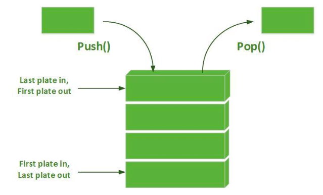
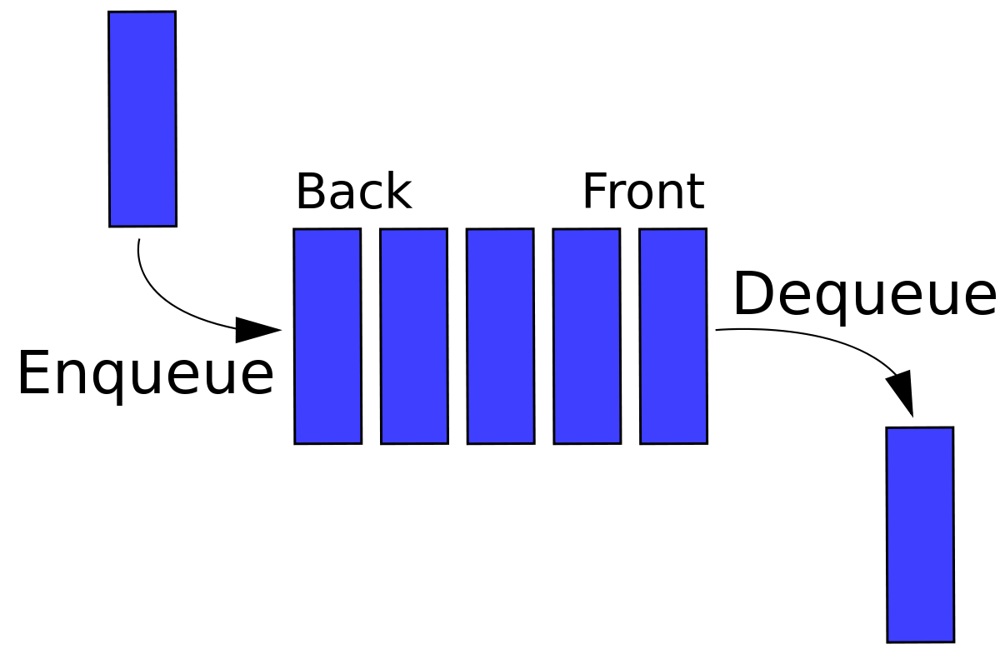

# Stack

Stack atau tumpukan adalah sebuah kumpulan data dimana data yang diletakkan di atas data yang lain. Dengan demikian stack bisa diartikan sebagai struktur data yang menggunakan konsep LIFO (Last In First Out) artinya data terakhir yang masuk merupakan data yang akan dikeluarkan terlebih dahulu. Jika kita asumsikan stack adalah sebuah tumpukan roti a sampai d (a,b,c,d) maka ketika kita ingin mengeluarkan roti c kita harus mengeluarkan roti yang berada ditumpukan atasnya terlebih dahulu yaitu roti d, pun begitu seterusnya jika kita ingin mengambil elemen yang lainnya kita harus mengeluarkan dulu semua elemen diatasnya, baru kita bisa mengambil elemen yang kita inginkan.

Berikut adalah ilustrasi sederhana dari sebuah stack.



Ilustrasi diatas merupakan ilustrasi dari stack beserta operasinya.

- Push digunakan untuk meletakan elemen pada bagian ter-atas stack.
- Sedangkan Pop digunakan untuk mengeluarkan elemen pada bagian ter-atas stack.

#### Penggunaan Stack

Stack biasa digunakan dalam mengontrol operasi dalam sebuah sistem operasi. Selain itu stack juga merupakan algoritma yang baik yang dapat digunakan untuk membuat phaser (membaca urutan operasi dari sebuah persamaan matematika). Serta digunakan dalam mengorganisir data seperti melakukan pengurutan etc.

#### Representasi Stack Dalam Sebuah Array

Ada beberapa cara untuk menyajikan sebuah stack tergantung pada
permasalahan yang akan kita selesaikan. Disini kita akan menggunakan cara yang paling sederhana, tipe data yang sudah kita kenal, yaitu array. Kita dapat menggunakan array untuk menyajikan sebuah stack, dengan anggapan bahwa banyaknya elemen maksimum dari stack tersebut tidak akan melebihi batas maksimum banyaknya elemen dalam array.

```c
#include <stdio.h>
#define MAXSTACK 5
typedef int ItemType;
/* Definisi struktur stack */
typedef struct
{
  int Item[MAXSTACK]; /* Array yang berisi data tumpukan */
  int Count; /* menunjukkan indeks data paling atas dari stack */
} Stack;

void InitializeStack(Stack *S)
{
  S->Count = 0;
}
int isEmpty(Stack *S)
{
  return (S->Count == 0);
}
int isFull(Stack *S)
{
  return (S->Count == MAXSTACK);
}

void Push(ItemType x, Stack *S)
{
  if (isFull(S))
    printf("Stack penuh! Data tidak dapat masuk!\n");
  else
  {
    S->Item[S->Count]=x;
    ++(S->Count);
  }
}

int Pop(Stack *S)
{
  if (isEmpty(S))//stack kosong
    printf ("Stack masih kosong!");
  else
  {
    --(S->Count);
    return (S->Item[S->Count]);
  }
}

int main()
{
  int i;
  int input;
  Stack tumpukan;
  InitializeStack(&tumpukan);
  for (i=0;i<=MAXSTACK;i++)
  {
    printf ("Masukkan isi stack ke- %d : ",i+1);
    scanf("%d",&input);
    Push(input,&tumpukan);
  }

  for (i=MAXSTACK;i>0;i--)
  {
    printf("Isi stack ke- %d : ",i) ;
    printf("%d \n",Pop(&tumpukan));
  }
}
```

Source code diatas merupakan bentuk representasi stack pada array.
terdapat beberapa function operasi didalamnya seperti:

- `InitializeStack` Inisialisasi awal stack
- `isEmpty` Fungsi yang melakukan pengecekan apakah stack dalam kondisi kosong
- `isFull` Fungsi yang melakukan pengecekan apakah stack dalam kondisi penuh
- `Push` Fungsi/Operasi menyisipkan elemen x ke dalam stack dan mengembalikan stack baru
- `Pop` Fungsi/Operasi mengambil/mengeluarkan elemen puncak stack , (pop(&tumpukan))

Kesimpulannya adalah:

- Stack menyimpan elemen/item dengan konsep LIFO, dimana item yang terakhir masuk akan keluar terlebih dahulu
- Elemen pada stack terdiri dari : item yang disimpan di penyimpan, penunjuk top of stack sekaligus menghitung jumlah elemen (count)
- Terdapat dua operasi stack yaitu PUSH dan POP
- Selain itu terdapat operasi tambahan yaitu inisialisasi, Penuh, Kosong

# Queue

Queue merupakan kebalikan dari stack yaitu sekumpulan data yang menggunakan konsep FIFO (First In First Out), yaitu data yang paling pertama dimasukan ke dalam queue merupakan data yang pertama kali keluar dari queue.



Operasi pada Queue

- `Enqueue` menyimpan item ke Queue
- `Dequeue` menghapus item dari Queue
- `Inisialisasi` inisialisasi awal Queue
- `Penuh` Cek apakah queue dalam kondisi kosong
- `Kosong` Cek apakah queue dalam kondisi penuh
- `Front` penunjuk elemen terdepan dari antrian)
- `Rear` penunjuk elemen terakhir dari antrian)

#### Representasi queue dalam sebuah array

```c
#include <stdio.h>
#define MAX 10

typedef struct {
 int Item[MAX];
 int Front;
 int Rear;
 int Count;
} Queue;
// Inisialisasi antrian
void Inisialisasi(Queue *q)
{
  q->Front = q->Rear = -1;
  q->Count = 0;
}
// Prosedur untuk menyisipkan data pada antrian
void Tambah(Queue *q, int item)
{
  if (q->Rear == MAX-1)
  {
    printf ("\nAntrian Penuh");
    return ;
  }
  q->Rear++;
  q->Item[q->Rear] = item;
  q->Count++;
  if (q->Front == -1) q->Front = 0;
}
// Prosedur untuk menghapus data dari antrian
int Hapus(Queue *q)
{
  int data ;
  if (q->Front == -1)
  {
    printf ("\nAntrian Kosong");
    return 0;
  }
  data = q->Item[q->Front];
  q->Count--;
  if (q->Front == q->Rear)
    q->Front = q->Rear = -1;
  else
    q->Front++;
  return data;
}
void Tampil(Queue *q)
{
  for(int i=0; i<q->Count; i++)
    printf("\nData : %d", q->Item[i]);
}
void main()
{
  Queue q;
  int data;
  Inisialisasi(&q);
  Tambah(&q,11);
  Tambah(&q,12);
  Tambah(&q,13);
  Tambah(&q,14);
  Tambah(&q,15);
  Tambah(&q,16);
  Tambah(&q,17);
  Tambah(&q,18);
  Tambah(&q,19);
  Tambah(&q,20);
  Tambah(&q,21);
  Tampil(&q);
  data = Hapus(&q);
  printf("\nHapus Item = %d ", data);
  data = Hapus(&q);
  printf("\nHapus Item = %d ", data);
  data = Hapus(&q);
  printf("\n Hapus Item = %d ", data);
  Tampil(&q);
}
```

Pada implementasi antrian dengan array, digunakan sejumlah array `MAX` untuk
menyimpan data. Untuk menunjuk bagian depan dan bagian belakang digunakan
variable `Front` dan `Rear`. Bila antrian kosong, nilainya diset -1. Untuk operasi
penambahan dan penghapusan diimplementasikan dua fungsi yaitu `Tambah()` dan
`Hapus()`.

Pada saat menambah elemen baru pada antrian, pertama kali dicek apakah
penambahan tersebut dimungkinkan atau tidak. Karena indeks array dimulai dengan
0 maka maksimum data yang dapat disimpan pada antrian adalah `MAX-1`. Jika semua
elemen menempati ruang array maka antrian dalam kondisi penuh. Apabila data
masih dapat ditambahkan pada antrian maka variable `Rear` dinaikkan satu dan data
baru disimpan pada array. Apabila data baru ditambahkan ke antrian untuk pertama
kali (dimana variable `Front` bernilai -1) maka variable `Front` diset 0 yang
menandakan antrian tidak lagi kosong.

Sebelum menghapus elemen dari antrian harus dipastikan apakah elemen
tersedia untuk penghapusan. Jika tidak maka antrian dalam kondisi kosong.
Sebaliknya bila tersedia data pada array maka dapat dilakukan penghapusan dan
variable `Front` dinaikkan. Apabila nilai variable `Front` dan `Rear` sama (yang
berarti antrian dalam keadaan kosong) maka Front dan `Rear` direset -1.

Misalnya akan dilakukan penambahan data pada antrian sampai semua array
terisi. Pada kondisi ini nilai `Rear` menjadi `MAX-1`. Misalnya dilakukan penghapusan
5 elemen, maka antrian dikatakan dalam kondisi penuh meskipun 5 array pertama
kosong. Untuk mengatasi kondisi ini maka diimplmentasikan antrian sebagai antrian
sirkular (_circular queue_). Sehingga selama penambahan jika sudah mencapai akhir array
dan jika awal array kosong (sebagai akibat dari penghapusan) maka elemen baru ditambahkan pada awal array.

Berikut adalah implementasi _circular queue_ :

```c
#include <stdio.h>
#define MAX 10

typedef struct {
  int Item[MAX];
  int Front;
  int Rear;
  int Count;
} Queue;

// Inisialisasi antrian
void Inisialisasi(Queue *q)
{
  q->Front = q->Rear = -1;
  q->Count = 0;
}
// Prosedur untuk menyisipkan data pada antrian
void Tambah(Queue *q, int item)
{
  if ((q->Rear == MAX-1 && q->Front == 0) || (q->Rear + 1 == q->Front))
  {
    printf ("\nAntrian Penuh");
    return ;
  }
  if (q->Rear == MAX - 1)
    q->Rear = 0;
  else
    q->Rear++;
    q->Item[q->Rear] = item;
    q->Count++;
  if (q->Front == -1) q->Front = 0;
}

// Prosedur untuk menghapus data dari antrian
int Hapus(Queue *q)
{
  int data ;
  if (q->Front == -1)
  {
    printf ("\nAntrian Kosong");
    return 0;

  }
  else
  {
    data = q->Item[q->Front];
    q->Count--;
    if (q->Front == q->Rear)
      q->Front = q->Rear = -1;
    else
    {
      if (q->Front == MAX-1)
        q->Front = 0;
      else
      q->Front++;
    }
 }
 return data;
}

void Tampil(Queue *q)
{
  for(int i=0; i<q->Count; i++)
    printf("\nData : %d", q->Item[i]);
}
void main()
{
  Queue q;
  int data;
  Inisialisasi(&q);
  Tambah(&q,11);
  Tambah(&q,12);
  Tambah(&q,13);
  Tambah(&q,14);
  Tambah(&q,15);
  Tambah(&q,16);
  Tambah(&q,17);
  Tambah(&q,18);
  Tambah(&q,19);
  Tambah(&q,20);
  Tambah(&q,21);
  Tampil(&q);
  data = Hapus(&q);
  printf("\nHapus Item = %d ", data);
  data = Hapus(&q);
  printf("\nHapus Item = %d ", data);
  data = Hapus(&q);
  printf("\nHapus Item = %d ", data);
  Tampil(&q);
}
```

Catatan kesimpulan:

- Queue merupakan konsep penyimpanan item secara FIFO, item yang masuk dahulu akan keluar lebih dahulu
- Elemen pada Queue terdiri dari : item yang disimpan di penyimpan, penunjuk depan (front), penunjuk belakang (rear) dan jumlah item (count)
- Operasi pada Queue : ENQUEUE dan DEQUEUE
- Operasi tambahan pada Queue : Inisialisasi, Penuh, Kosong
