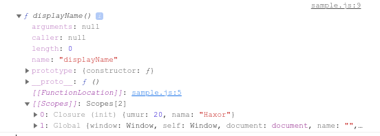
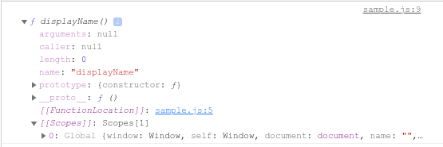

# Closures

Closures adalah inner function yang mempunyai akses ke parent scopenya, dan scope-scope di function luar lainnya, meskipun parent scopenya sudah selesai dieksekusi.

Secara sederhana closures merupakan function yang didefiniskan didalam function lainnya. meskipun sepenuhnya tidak seperti itu tapi kita sederhanakan dahulu.

Closures bisa mengakses ke variabel-variabel yang ada di dalam scope yang berbeda:

- Variabel yang ada di dalam scope nya sendiri (ini udah jelas bisa lah ya)
- Variabel yang ada di dalam scope global
- Dan variabel yang ada di dalam scope function di luar nya / parent function nya.

Selain itu Closures juga bisa mengakses:

- Parameter yang dia punya (ini udah jelas bisa lah, ya);
- Parameter yang ada di dalam function di luar nya / parent function nya.

Lihat contoh berikut:

```javascript
function init() {
  // nama adalah sebuah lokal variabel yang dibuat oleh init
  let nama = "Haxor"

  // displayName() adalah inner function, sebuah closure
  function displayName() {
    /* displayName() mengakses parent scopenya dengan menggunakan variabel yang dideklarasikan pada parent scopenya.*/
    console.log(nama)
  }
  displayName()
}
init()
```

Perhatikan function `init()` diatas, didalamnya terdapat function lagi yang bernama `displayName()`. Nah, `displayName()` ini adalah sebuah inner function dan lebih dari itu function tersebut bukan sekedar inner function karena ia mengakses variabel `nama` yang terdapat dalam parent scopenya maka ia disebut closures. Jika function `displayName()` tidak mengakses parent scopenya, atau outer scope lainnya baik berupa variabel maupaun parameter maka ia hanya sekedar inner function biasa.

Karena konsep dasar dari closures, adalah mengakses variabel dan parameter baik parent scope,maupun scope terluar lainnya (outer scope).

Perhatikan kode berikut:

1. function displayName() berperan sebagai closures

```javascript
function init(umur) {
  // nama adalah sebuah lokal variabel yang dibuat oleh init
  let nama = "Haxor"

  // displayName() adalah inner function, sebuah closure
  function displayName() {
    /* displayName() mengakses parent scopenya dengan menggunakan variabel yang dideklarasikan pada parent scopenya.*/
    console.log(nama)
    console.log(umur)
  }
  console.dir(displayName)
}
init(20)
```



2. function displayName() hanya sebagai inner function biasa

```javascript
function init() {
  let nama = "Haxor" // nama adalah sebuah lokal variabel yang dibuat oleh init

  // displayName() adalah inner function, sebuah closure
  function displayName() {
    /* displayName() tidak mengakses parent scopenya tapi menggunakan variabel yang dideklarasikan pada scopenya.*/
    let nama = "Andre"

    console.log(nama)
  }
  console.dir(displayName)
}
init()
```



Pada contoh 1 inner function berperan sebagai closures karena mengakses variabel dan parameter parentnya, sedangkan pada contoh 2 inner function hanya berperan sebagai inner function biasa karena tidak mengakses apapun yang diluar scopenya.

Sampai sini kita pahamkan,(secara sederhana) apa itu closures dan bagaimana cara kerja dari closures :smile_cat:

### Kenapa kita perlu menggunakan closures ?

Closures sangat penting karena dia mengontrol apa yang ada dan tidak ada dalam cakupan (scope) function tertentu. Selain itu juga mengatur variabel mana yang dibagikan antara function dalam lingkup yang sama.

Closures dikategorikan sebagai konsep intermediate dalam javascript bahkan ada yang mengkategorikannya sebagai konsep advanced. Di luar itu semua-closures merupakan konsep fundamental Javascript yang artinya kamu wajib dan harus paham konsep closures ini. Semoga dengan adanya artikel ini akan membantu kamu sedikitnya paham tentang konsep closures ini. :grin:
