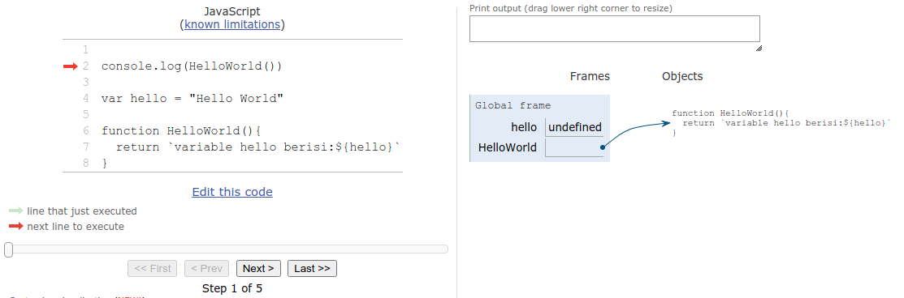
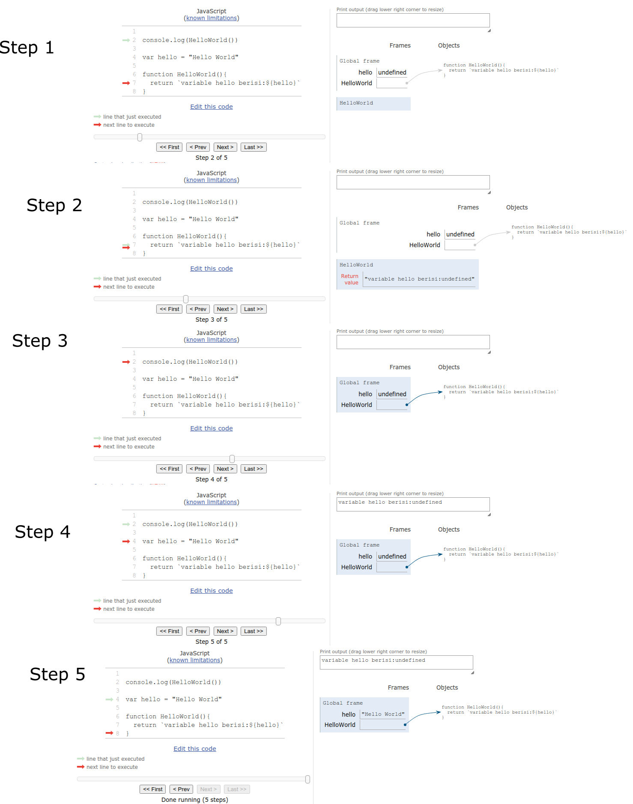
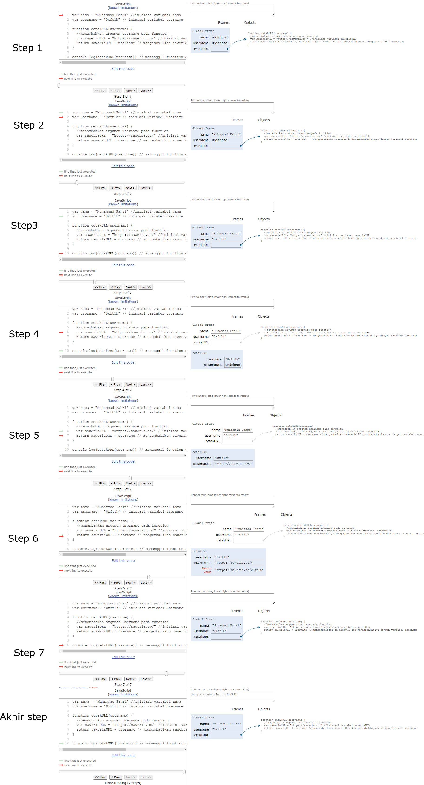

# Hoisting


Hoisting jika diartikan kedalam bahasa indonesia artinya "mengangkat,mengerek atau menaikan" yups hoisting merupakan konsep dalam javascript dimana iya akan menaikkan atau mengerek seluruh deklarasi `function` dan `variabel` kebagian atas code program ketika di eksekusi, tapi yang harus dipahami disini adalah javascript tidak benar-benar memindahkan `variabel` dan `function` ke bagian atas codingan kita melainkan hanya memindahkan deklarasinya saja bukan inisiasinya.

Sebagai contoh :

```javascript
// undefined
console.log(hello)
var hello = "Hello World"
```

Codingan diatas akan menghasilkan log berupa `undefined`, kenapa `undefined`? pasti kalian berfikir karena javascript membaca `console.log` terlebih dahulu dan tidak mengenali `var hello` sehingga outputnya `undefined`, tentu saja itu kesalahan besar karena jika `console.log` tidak mengenali `var hello` maka akan terjadi log error ketika kita menjalankan program diatas sebagai contoh:

```javascript
/* akan terjadi error 'Uncaught ReferenceError: hello is not defined at sample.js:1' karena console.log tidak mengenali variabel hello alias javascript membaca jika variabel hello tidak di definisikan */

console.log(hello)
```

Lalu kenapa codingan sebelumnya menghasilkan log `undefined` nah itu lah yang disebut Hoisting, jadi ketika program dieksekusi ia akan memindahkan seluruh deklarasi `variabel' ke atas seperti berikut.

```javascript
/* yang terjadi sebenarnya deklarasi variabel hello dipindahkan keatas seperti ini, tapi ingat hanya deklarasinya saja tanpa inisiasi sehingga inisiasi variabelnya 'undefined' */
var hello
console.log(hello) //undifined
var hello = "Hello World" // menginisiasikan variabel
```

Lalu bagaimana dengan `function` ? yups `function` juga deklarasinya akan dipindahkan keatas sebagai contoh:

```javascript
console.log(HelloFriend)
/* lognya akan mengeluarkan deklarasi function itu sendiri dalam contoh disini outputnya berupa :

ƒ HelloFriend() {
    console.log(hello);
}
*/

/* jika kita jalankan functionnya maka outputnya akan 'isi variabel :undefined' karena variabel hello tidak terinisiasi akibat terkena hoisting */
console.log(HelloFriend())

var hello = "Hello World"
function HelloFriend() {
  console.log(`isi variabel hello :${hello}`)
}
```

Perbedaan penting antara deklarasi `function` (function declarations) dan deklarasi `class` (class declarations) adalah deklarasi function hoisted dan deklarasi class tidak. Pertama-tama kita harus mendeklarasikan class dan mengaksesnya, jika tidak maka code seperti berikut akan menampilkan ReferenceError:

```javascript
/* reference error karena kelas tidak terhoisting dengan kata lain deklarasi class tidak di hoisting saat dijalankan */
var hello = new Hello()
class Hello {}
```

Oke sampai sini kita sudah memahami hoisting bukan? Selanjutnya kita akan membahas `Execution Context`(Konteks Eksekusi).

# Execution Context

`Execution Context` didefinsikan sebagai konteks atau lingkungan dimana javascript di eksekusi. `Execution Context` merupakan pembungkus yang mengelola code yang sedang di jalankan. `Execution Context` terbagi menjadi 2 yaitu `Global Execution Context` dan `Local Execution Context`. Dan dalam javascript terdapat 2 fase (2 Phase) pada saat `Execution Context` yaitu `creation phase` dan `execution phase`.

### Creation Phase (Fase Kreasi) dan Execution Phase (Fase Eksekusi)

Salah satu keunikan javascript adalah javascript tidak langsung menjalankan code dari atas kebawah. Melainkan membagi tahapan eksekusi menjadi dua tahapan yaitu `Creation Phase` dan `Execution Phase`. Ketika code javascript dieksekusi yang pertama kali dijalankan adalah `Creation Phase`.

Berikut adalah apa yang terjadi ketika `Creation Phase`:

1. Javascript akan mencari semua keyword terkait deklarasi variabel dan function seperti `var`,`const`,`let`,`function()` dan yang keyword lainnya yang berkaitan dengan hal itu, kemudian menginisiasi nilai dari variabel yang dideklarasikan dengan `undefined` atau jika function akan di isi dengan deklarasi function itu sendiri `function = fn()` tanpa dijalankan.
2. Javascript akan mendefinisikan `window` sebagai `global object`.
3. javascript akan mendefinisikan `this` sebagai `window`

Nah sekarang kita paham pada `Creation Phase` inilah hoisting terjadi. Kemudian setelah `Creation Phase` selesai maka javascript akan memasuki `Execution Phase`. Pada `Execution Phase` javascript akan menjalankan code program kita secara sinkronis (synchron) dari atas kebawah. Agar lebih jelasnya berikut adalah visualisasi bagaimana javascript mengeksekusi program kita:

- Creation Phase (Fase Kreasi)
  

Gambar diatas adalah visualisasi ketika javascript pertama kali di eksekusi, ia akan menjalankan `Creation Phase` yaitu javascript mengangkat(menghoisting) seluruh variabel dan function ke atas atau dalam visualisasi ke dalam global frame, kemudian menginisiasi variabelnya dengan `undefined` dan menginisiasi function dengan function itu sendiri. Sampai disini sudah jelaskan? bagaimana `Creation Phase` terjadi selanjutnya kita akan melihat bagaimana `Execution Phase` terjadi.

- Execution Phase(Fase Eksekusi)

  

Pada visualisasi diatas dijelaskan bagaimana `Execution Phase` terjadi. Setelah `Creation Phase` dijalankan javascript akan menjalankan code secara synchron(Sinkronis) dari atas kebawah dan disinilah `Execution Phase` terjadi. Dimulai dengan menjalankan `console.log(HelloWorld())`(step 1) kemudian memanggil deklarasi functionnya (step 2) setelah itu menjalankan function tersebut (step 3) yang menghasilkan log`variabel hello berisi: undefined` (step 4), kemudian pada (step 5) baru menjalankan inisiasi `var hello = 'Hello World'`. Kenapa function tersebut menghasilkan output variabel `undefined`? tentu sekarang kita sudah tahu karena terjadi hoisting, deklarasi function yang dijalankan pertama akan membaca deklarasi `variabel` yang diinisasi pada saat `Creation Phase` sehingga output variabelnya kan menjadi `undefined`. Sekilas terlihat bolak balik dan agak ribet tapi disitulah keunikan dan keistimewaan dari javascript.

Sebenarnya jika kita liat di visualiasinya pada saat menjalankan function dia seolah membuat lingkup `Execution Context` sendiri yang kita sebut Local `Execution Context` yang didalamnya juga terdapat `Creation Phase` dan `Execution Phase` serta `Hoisting` yang lingkupnya hanya dalam function tersebut (jadi apabila ada variabel yang didefinisikan didalam function maka variabel tersebut juga awalnya akan diberi nilai `undefined` di dalam function tersebut), selain itu kita juga dapat mengakses `arguments` dalam `Local Execution Context`. Lebih jelasnya mari kita liat contoh kasus berikut berikut:

```javascript
var nama = "Muhammad Fahri" //inisiasi variabel nama
var username = "0xft1h" // inisiasi variabel username

//menambahkan argumen username pada function
function cetakURL(username) {
  //inisiasi variabel saweriaURL
  var saweriaURL = "https://saweria.co/"
  /* mengembalikan saweriaURL dan menambahkannya dengan variabel username */
  return saweriaURL + username
}

/* memanggil function cetakURL dan mengisi argumennya dengan variabel username */
console.log(cetakURL(username))
```

Sekilas jika kita jalankan code diatas tidak error dan memang tidak ada masalah dari code diatas tapi code diatas akan kita gunakan untuk memahami local `Execution Context`. Mari kita liat visualisasi dari code diatas.


- Pada step 1 seperti biasa terjadi hoisting pada saat `creation phase` pada `global execution context`sehingga inisiasi variabel nama dan username berisi `undefined`

- Pada step 2 dan 3 kita mulai menjalankan `execution phase` dalam `global execution context` yang menginisasi variabel dan menjalankan log terhadap `function cetakURL`

- Pada step 4 kita menjalankan `local execution context` dengan 2 fase yang sama yaitu `creation phase` dan `execution phase`, pada step ini kita lihat `local execution context` kita menjalankan `creation phase` sehingga inisiasi dari `var saweriaURL` adalah `undefined`

- Pada step 5 dan 6 kita menjalankan `execution phase` dalam `local execution context` kita sehingga `var saweriaURL` terinisiasi dengan benar.

- Pada Step 7 dan akhir step kita kembali ke `global execution context` dan menjalankan log `function cetakURL` yang sudah terinisiasi dengan baik, sehingga menampilkan return dengan benar.

Sampai sini apa kalian sudah paham tentang `global execution context`? apa justru pusing karena terlihat bolak balik :D tenang akan saya berikan satu contoh lagi sebagai berikut:

```javascript
/*javascript akan melakukan creation phase pada global execution context dan menghoisting isi function a */
function a() {
  /* execution phase: Menjalankan console.log ('ini a') dan tampil ke layar 'ini a' lalu loncat ke function 'b' dan membuat local Execution Context. */
  console.log("ini a")

  /* creation phase: pada local execution context dan menghoisting function b */
  function b() {
    /* creation phase: pada local execution context dan menghoisting function c */
    function c() {
      /* tidak terjadi creation phase karena tidak ada function atau variabel dalam function c */

      /* Execution phase : Menjalankan console.log ('ini c') dan tampil ke layar 'ini c'. */
      console.log("ini c")
    }
    /* execition phase: Menjalankan console.log ('ini b') dan tampil ke layar 'ini b' lalu loncat ke function c dan membuat local Execution Context. */
    console.log("ini b")

    // menjalankan function c pada saat execution phase
    c()
    // function c selesai dijalankan
  }
  b() // menjalankan function b pada saat execution phase
  // function b selesai dijalankan
}

a() //menjalankan function a pada saat execution phase

//function a selesai dijalankan
```

- catatan dalam proses `execution context` diatas sebenarnya juga terjadi `execution stack`. Action-action atau events harus menunggu untuk dieksekusi, dan dikumpulkan di tempat yang namanya `execution stack` . Stack itu menggunakan salah satu metode LIFO (Last In first Out) yang terakhir masuklah yang akan dikeluarkan duluan dari `execution stack`, jika code diatas di visualisasikan maka akan terlihat `executioin context` pada `function c`lah yang akan dikeluarkan pertama dari `execution stack`.

Sampai sini kita sudah pahamkan tentang Hoisting dan `Execution Context`? Selanjutnya kita akan membahas tentang Scope.

# Scope

Scope jika diartikan kedalam bahasa indonesia artinya "cakupan atau jangkauan", yups sesuai artinya scope dalam javascript adalah konsep yang digunakan untuk membatasi cakupan pengakses suatu variabel dan function. Terdapat dua jenis scope yaitu `local/function-based scope `dan `global scope`.

- Global Scope

  `global scope` merupakan scope terluar dari di dalam javasacript.Sesuai dengan namanya global yang berarti variabel atau function yang dideklarasikan di dalam `global scope`, akan dapat dapat diakses oleh seluruh function maupun seluruh blok dalam code kita. t. berikut salah satu contoh sederhana `global scope`

  ```javascript
  // inisiasi sebuah variabel dalam global scope
  var digimon1 = "Agumon"
  var digimon2 = "Gatomon"
  function evolution() {
    // inisiasi variabel local, "local scope variable"
    var digimon1 = "Greymon"

    // mengambil variabel dari `local/function scope`
    console.log(`ini digimon-1 dalam function/local scope:${digimon1}`)

    // mengambil variabel dari `global scope`
    console.log(`ini digimon-2 dalam global scope :${digimon2}`)
  }

  // Show the result

  evolution() //greymon dan gatomon
  console.log(`ini digimon-1 dalam global scope: ${digimon1}`) // agumon
  console.log(`ini digimon-2 dalam global scope: ${digimon2}`) // Gatomon
  ```

  Variabel yang dideklarasikan dengan `var` jika berada didalam global scope akan bisa diakses dari blok code manapun baik diluar maupun dalam `function`, bahkan dapat diakses oleh library javascrip yang kita gunakan, inilah yang disebut dengan `global scope`, pemakaian `global scope` sangat beresiko, karena jika salah satu dari variabel yang kita buat ternayat juga dipakai oleh blok code yang lain, maka salah satunya akan teroverride atau bahkan tidak dapat diakses sesuai dengan seharusnya.

- Local/Function-Based Scope

  `local scope` merupakan scope yang berada dalam block-scopped(blok code yang berupa curly brackets{}). Kebalikan dari `global scope`, `functional/local scope` adalah variabel atau function yang dideklarasikan di dalam function dan hanya dapat diakses oleh blok code didalam function tersebut, termasuk function yang dideklarasikan di dalamnya. Mari kita liat contoh berikut:

  ```javascript
  function localDigimon() {
    var digimon = "Agumon"
    console.log(digimon)
  }

  localDigimon()
  console.log(digimon)
  ```

  Code diatas jika dijalankan hanya akan muncul log satu kali dan sesudahnya log error, karena `console.log` dalam `global scope` tidak dapat mengakses variabel dalam `local/function scope` sebaliknya jika variabel tersebut dimasukan kedalam `global scope` maka seluruh blok code akan bisa mengakses variabel tersebut. variabel yang dideklarasikan dengan `var` jika dalam suatu function tidak dapat diakses secara global dari luar.

  Dan Khusus untuk pendeklarasian dengan `let` dan `const` yang merupakan block-scoped(konten yang berada didalam curly brackets{}) bukan hanya dalam function saja mereka tidak dapat diakses secara global namun semua jenis blok seperti statemen `if`,`for`, `while` dan sejenisnya. berikut contoh penggunaan `let` dalam blok `if`.

  ```javascript
  var trigger = true

  // inisiasi global variabel
  let digimon = "Agumon"

  if (trigger) {
    // inisiasi  block-scoped variabel
    let digimon = "Greymon"
    console.log(`Evolution triggered, you are become ${digimon}.`) // Greymon
  }

  console.log(`Evolution failed, you are still ${digimon}.`) // Agumon
  ```

  hasilnya akan berbeda jika kita menggunakan `var`.

  ```javascript
  var trigger = true

  // inisiasi global variabel
  var digimon = "Agumon"

  if (trigger) {
    // membuat variabel baru didalam block dengan menggunakan var
    var digimon = "Greymon"
    console.log(`Evolution triggered, you are become ${digimon}.`) //Greymon
  }

  console.log(`Evolution failed, you are still ${digimon}.`) // GreyMon
  ```

  Baik `global` maupun `blocked-scoped` variabel menampilkan nilai yang sama yaitu "Greymon", karena dengan `var` tidak menganggap dalam if merupakan block yang berbeda, jadi disini kita hanya melakukan reassign terhadap variabel tersebut. dianjurkan menggunakan block-scoped `const` dan `let` agar terhindar dari override code.

Baik sampai disini dulu pembahasan kita kurang lebihnya saya memohon maaf, jika ada yang ingin ditanyakan silahkan tinggalkan komentar 🙏
